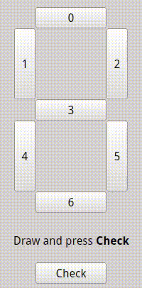

# PyQt-BPNN

A PyQt GUI app that uses Back-Propagation Neural Networks to train and match user defined patterns.

Basically the app tests 10 `7 segment display` pattern with their actual values like the following. A 7 segment display looks like the following.

    ```
    ---0---
    |     |
    1     2
    |     |
    ---3---
    |     |
    4     5
    |     |
    ---6---
    ```

A 7bit-input vs 4bit-output map would look like this.

    ```
    [
    # 0  1  2  3  4  5  6
    [[1, 1, 1, 0, 1, 1, 1], [0, 0, 0, 0]], # 0
    [[0, 0, 1, 0, 0, 1, 0], [0, 0, 0, 1]], # 1
    [[1, 0, 1, 1, 1, 0, 1], [0, 0, 1, 0]], # 2
    [[1, 0, 1, 1, 0, 1, 1], [0, 0, 1, 1]], # 3
    [[0, 1, 1, 1, 0, 1, 0], [0, 1, 0, 0]], # 4
    [[1, 1, 0, 1, 0, 1, 1], [0, 1, 0, 1]], # 5
    [[1, 1, 0, 1, 1, 1, 1], [0, 1, 1, 0]], # 6
    [[1, 1, 1, 0, 0, 1, 0], [0, 1, 1, 1]], # 7
    [[1, 1, 1, 1, 1, 1, 1], [1, 0, 0, 0]], # 8
    [[1, 1, 1, 1, 0, 1, 1], [1, 0, 0, 1]]  # 9
    ]
    ```

The program trains a Neural Network with 7bit input, 7bit hidden and 4bit output nodes. Then the user can click and draw any number. On clicking `Check`, the user provided segment values will be tested and a predicted value from the network will be shown.

# How to Run

To run, `python3 Widget.py`

Then a pattern will be tested.

    ```
    Creating Neural Network...
    Training patterns...
        error 10.45545 iterations 0
        error 3.79253 iterations 1000
        error 2.73814 iterations 2000
        error 3.66140 iterations 3000
        .............................
    Training complete!
    ```

And finally the user can provide input patterns and get predicted results.



# Back-Propagation Neural Networks

Written by Neil Schemenauer `<nas@arctrix.com>`